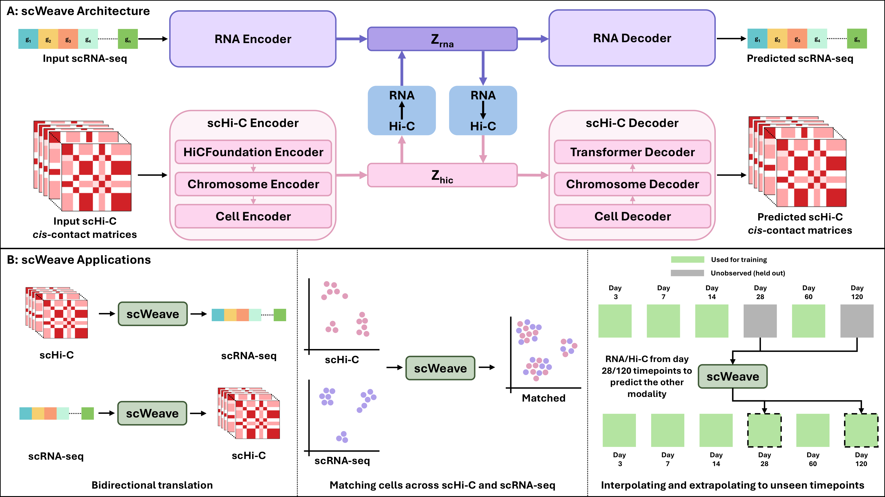

# scWeave: A deep learning model that bidirectionally translates between gene expression and chromatin structure at single-cell resolution

Chromatin structure and gene expression are intimately linked, yet characterizing how the two covary has proven challenging, primarily because the two modalities are rarely measured in the same cells.
Recently, single-cell co-assay protocols have enabled simultaneous profiling of both modalities within the same cells, but these experiments remain costly and technically challenging.
To better characterize the relationship between 3D chromatin architecture and gene expression and to enable cross-modality inference from single-modality measurements, we developed a model called scWeave that bidirectionally translates between gene expression (scRNA-seq) and 3D chromatin architecture (scHi-C) at single-cell resolution.
The scWeave model employs dual autoencoders to extract separate cell-level latent representations and learns to translate between these representations using dedicated translation modules.
We evaluate scWeave on six publicly available co-assay datasets spanning mouse embryonic development, mouse cortex, mouse olfactory epithelium, and human bone marrow.
On held-out mouse cells, scWeave outperforms a nearest-neighbor baseline and existing methods adapted to single-cell resolution, achieving a 57% improvement in median Spearman correlation when predicting gene expression from chromatin structure and an 18.8% improvement in median HiCRep similarity in the reverse direction relative to the next-best baseline.
We further show that scWeave learns cross-modally aligned latent representations at single-cell resolution, enabling cells profiled in one modality to be matched to their counterparts in the other.
Finally, scWeave generalizes to entirely held-out developmental timepoints in mouse olfactory epithelium and performs well on held-out human bone marrow cells despite limited human training data.
By predicting the unmeasured chromatin architecture or transcriptional state from a single measured modality, scWeave offers a route to extend the benefits of costly co-assays to the many cell types, developmental stages, and species that are currently profiled with only one modality.

<p align="center">
  
</p>

---

## Requirements
- Python >= 3.10
- A CUDA-capable GPU is recommended for both training and inference. 

All dependencies are installed automatically (see `pyproject.toml`).

## Installation

### 1. Clone the repository

```bash
git clone https://github.com/Noble-Lab/scWeave.git
cd scWeave
```

### 2. Create an isolated environment with [uv](https://docs.astral.sh/uv/)

```bash
uv venv
source .venv/bin/activate        # Windows: .venv\Scripts\activate
```

### 3. Install scWeave

```bash
uv pip install -e .
```

This pulls in all dependencies and exposes the `scweave` package.

### 4. Verify the installation

```bash
python -c "import scweave; print(scweave.__version__)"
```

---

## Model weights

Pretrained scWeave weights are hosted on the Hugging Face Hub at
[`gmurtaza404/scWeave`](https://huggingface.co/gmurtaza404/scWeave):

| File | Model | Species | Chromosomes | `gene_names` |
| :--- | :--- | :--- | ---: | :--- |
| `scweave_figure2_mouse.ckpt` | mouse co-assay (Figure 2) | mouse | 20 | `"mouse"` |
| `scweave_figure3_mouse.ckpt` | mouse + olfactory timepoints (Figure 3) | mouse | 20 | `"mouse"` |
| `scweave_figure4_human.ckpt` | human bone marrow (Figure 4) | human | 23 | `"human"` |

Download a checkpoint and load it:

```bash
hf download gmurtaza404/scWeave scweave_figure2_mouse.ckpt --local-dir weights
```

```python
from scweave import scWeave

model = scWeave.load("weights/scweave_figure2_mouse.ckpt")   # GPU if available, else CPU
```

Or fetch it directly in Python:

```python
from huggingface_hub import hf_hub_download
from scweave import scWeave

path = hf_hub_download("gmurtaza404/scWeave", "scweave_figure2_mouse.ckpt")
model = scWeave.load(path)
```

---

## Inference

See [`examples/inference/inference.md`](examples/inference/inference.md) for
detailed, step-by-step instructions for running a trained model on the HiRES brain
subset: preparing the RNA and Hi-C inputs, loading the weights, and running
prediction and matching.

In brief:

```python
from scweave import scWeave

model = scWeave.load("scweave_figure2_mouse.ckpt")

hic_pred = model.predict_hic_from_rna(rna)           # (n_cells, n_chr, 224, 224)
rna_pred = model.predict_rna_from_hic(hic)           # (n_cells, n_genes)
similarity, matches = model.match(rna, hic, direction="rna_to_hic")
```

---

## Training

See [`examples/training/training.md`](examples/training/training.md) for detailed,
step-by-step instructions for training scWeave from scratch: preparing datasets
from source, building the training splits with `prepare_dataset`, and training the
model with `train_translator`.

---

## Examples

Each example folder pairs a notebook with a written walkthrough:
- [`examples/inference/`](examples/inference) — load a trained model, prepare
  inputs, and run prediction and cross-modal matching
  ([notebook](examples/inference/inference.ipynb),
  [walkthrough](examples/inference/inference.md)).
- [`examples/training/`](examples/training) — prepare a dataset and train scWeave
  from scratch
  ([notebook](examples/training/training.ipynb),
  [walkthrough](examples/training/training.md)).

Coming soon!

---

## License

scWeave is released under the [Apache License 2.0](LICENSE).
